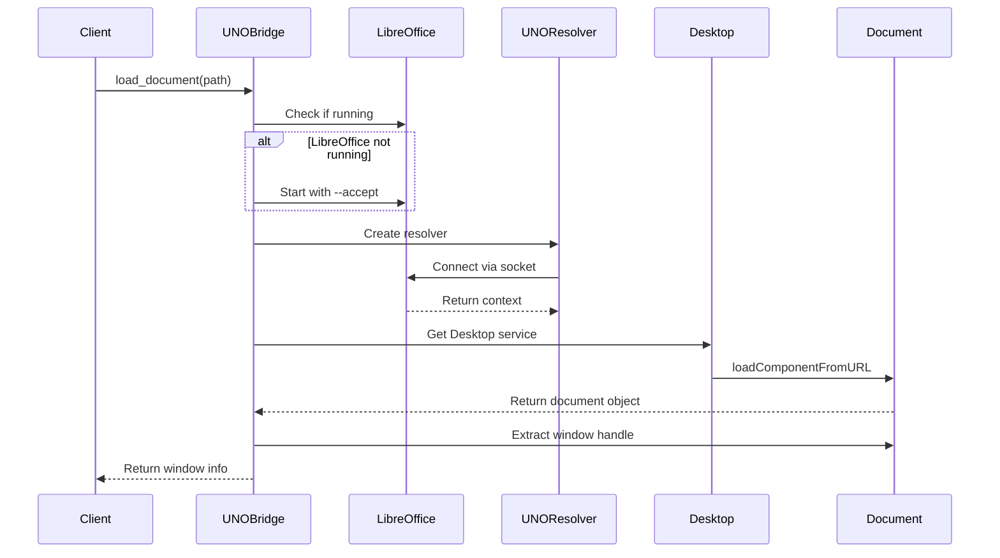

# Ultra-Detailed Execution Plan: Enhance UNO Bridge with Document Loading

## Overview
This document provides an exhaustive execution plan for implementing actual document loading via UNO API in the `uno_bridge.py` file. This is the foundational feature that enables true native LibreOffice integration.

## Current State Analysis

### What Exists:
```python
# uno_bridge.py currently has:
- UNO socket server startup
- Port allocation
- Basic LibreOffice process management
- Status checking
- Graceful shutdown
```

### What's Missing:
- No actual document loading
- No UNO component context
- No document manipulation
- No window handle extraction
- No event handling

## Technical Architecture Deep Dive

### 1. UNO API Architecture Understanding

**Component Hierarchy:**
```
LibreOffice Process
├── Component Context (XComponentContext)
│   ├── Service Manager (XMultiServiceFactory)
│   │   ├── Desktop Service (com.sun.star.frame.Desktop)
│   │   │   ├── Document Loader (XComponentLoader)
│   │   │   ├── Frame Management (XFrames)
│   │   │   └── Document Components (XComponent)
│   │   └── UNO Bridge Resolver
│   └── UNO URL Resolver
└── Document Model
    ├── Controller (XController)
    │   └── Frame (XFrame)
    │       └── Container Window (XWindow)
    └── View (XViewDataSupplier)
```

### 2. Connection Flow Sequence



## Detailed Implementation Steps

### Phase 1: UNO Connection Management (Day 1-2)

**Step 1.1: Import Required UNO Modules**
```python
# In uno_bridge.py, add:
import uno
import unohelper
from com.sun.star.connection import NoConnectException
from com.sun.star.lang import IllegalArgumentException
from com.sun.star.io import IOException
from com.sun.star.beans import PropertyValue
from com.sun.star.frame import XComponentLoader
from com.sun.star.util import XCloseable
```

**Step 1.2: Create Connection Manager Class**
```python
class UNOConnection:
    def __init__(self, host='localhost', port=2002):
        self.host = host
        self.port = port
        self.local_context = None
        self.resolver = None
        self.context = None
        self.desktop = None
        self._connected = False
    
    def connect(self, max_retries=3):
        """Establish UNO connection with retry logic"""
        for attempt in range(max_retries):
            try:
                # Get local context
                self.local_context = uno.getComponentContext()
                
                # Create UNO URL resolver
                self.resolver = self.local_context.ServiceManager.createInstanceWithContext(
                    "com.sun.star.bridge.UnoUrlResolver", 
                    self.local_context
                )
                
                # Build connection string
                connection_string = (
                    f"uno:socket,host={self.host},port={self.port};"
                    f"urp;StarOffice.ComponentContext"
                )
                
                # Resolve the connection
                self.context = self.resolver.resolve(connection_string)
                
                # Get desktop service
                self.desktop = self.context.ServiceManager.createInstanceWithContext(
                    "com.sun.star.frame.Desktop",
                    self.context
                )
                
                self._connected = True
                return True
                
            except NoConnectException as e:
                logger.warning(f"Connection attempt {attempt + 1} failed: {e}")
                if attempt < max_retries - 1:
                    time.sleep(2 ** attempt)  # Exponential backoff
                else:
                    raise
        
        return False
```

**Step 1.3: Property Value Helper Functions**
```python
def create_property(name: str, value: Any) -> PropertyValue:
    """Create a UNO PropertyValue"""
    prop = PropertyValue()
    prop.Name = name
    prop.Value = value
    return prop

def create_properties(**kwargs) -> tuple:
    """Create multiple PropertyValues from kwargs"""
    return tuple(create_property(k, v) for k, v in kwargs.items())
```

### Phase 2: Document Loading Implementation (Day 3-4)

**Step 2.1: Document Loader Class**
```python
class DocumentLoader:
    def __init__(self, desktop):
        self.desktop = desktop
        self.loaded_documents = {}  # Track loaded documents
        
    def load_document(self, file_path: str, hidden: bool = False) -> 'LoadedDocument':
        """Load a document and return wrapper object"""
        # Validate file path
        abs_path = Path(file_path).resolve()
        if not abs_path.exists():
            raise FileNotFoundError(f"Document not found: {file_path}")
        
        # Convert to file URL
        file_url = uno.systemPathToFileUrl(str(abs_path))
        
        # Create load properties
        load_props = []
        load_props.append(create_property("Hidden", hidden))
        load_props.append(create_property("ReadOnly", False))
        load_props.append(create_property("AsTemplate", False))
        
        # Add format detection
        load_props.append(create_property("FilterName", ""))  # Auto-detect
        
        try:
            # Load the document
            document = self.desktop.loadComponentFromURL(
                file_url,
                "_blank",  # Target frame
                0,         # Search flags
                load_props
            )
            
            if not document:
                raise RuntimeError("Failed to load document")
            
            # Create wrapper
            loaded_doc = LoadedDocument(document, file_path)
            self.loaded_documents[file_path] = loaded_doc
            
            return loaded_doc
            
        except IllegalArgumentException as e:
            raise ValueError(f"Invalid document format: {e}")
        except IOException as e:
            raise IOError(f"IO error loading document: {e}")
```

**Step 2.2: Loaded Document Wrapper**
```python
class LoadedDocument:
    def __init__(self, component, file_path):
        self.component = component
        self.file_path = file_path
        self.controller = None
        self.frame = None
        self.window = None
        self._extract_window_info()
    
    def _extract_window_info(self):
        """Extract window and frame information"""
        try:
            # Get current controller
            self.controller = self.component.getCurrentController()
            if not self.controller:
                raise RuntimeError("No controller available")
            
            # Get frame
            self.frame = self.controller.getFrame()
            if not self.frame:
                raise RuntimeError("No frame available")
            
            # Get container window
            self.window = self.frame.getContainerWindow()
            if not self.window:
                raise RuntimeError("No window available")
                
        except Exception as e:
            logger.error(f"Failed to extract window info: {e}")
            raise
    
    def get_window_handle(self):
        """Get platform-specific window handle"""
        if not self.window:
            return None
            
        # Get system-specific window handle
        try:
            # Try to get window peer
            window_peer = self.window
            
            # Platform-specific extraction
            if platform.system() == "Windows":
                # Windows: Get HWND
                return self._get_windows_handle(window_peer)
            elif platform.system() == "Linux":
                # Linux: Get X11 Window ID
                return self._get_x11_handle(window_peer)
            elif platform.system() == "Darwin":
                # macOS: Get NSWindow reference
                return self._get_macos_handle(window_peer)
                
        except Exception as e:
            logger.error(f"Failed to get window handle: {e}")
            return None
```

### Phase 3: Platform-Specific Window Handle Extraction (Day 5-6)

**Step 3.1: Windows Implementation**
```python
def _get_windows_handle(self, window_peer):
    """Extract HWND on Windows"""
    try:
        # Access toolkit
        toolkit = self.window.getToolkit()
        
        # Get system window peer
        system_window = toolkit.getSystemWindow(window_peer)
        
        # Extract HWND using UNO
        if hasattr(system_window, 'getWindowHandle'):
            hwnd = system_window.getWindowHandle()
            return {'type': 'hwnd', 'handle': hwnd}
            
        # Alternative method using ctypes
        import ctypes
        from ctypes import wintypes
        
        # Get window title to find handle
        title = self.frame.getTitle()
        
        def enum_windows_callback(hwnd, windows):
            if ctypes.windll.user32.IsWindowVisible(hwnd):
                length = ctypes.windll.user32.GetWindowTextLengthW(hwnd)
                buff = ctypes.create_unicode_buffer(length + 1)
                ctypes.windll.user32.GetWindowTextW(hwnd, buff, length + 1)
                if title in buff.value:
                    windows.append(hwnd)
            return True
        
        windows = []
        ctypes.windll.user32.EnumWindows(
            ctypes.WINFUNCTYPE(ctypes.c_bool, wintypes.HWND, ctypes.py_object)(enum_windows_callback),
            windows
        )
        
        if windows:
            return {'type': 'hwnd', 'handle': windows[0]}
            
    except Exception as e:
        logger.error(f"Windows handle extraction failed: {e}")
    return None
```

**Step 3.2: Linux/X11 Implementation**
```python
def _get_x11_handle(self, window_peer):
    """Extract X11 Window ID on Linux"""
    try:
        # Try direct UNO method
        toolkit = self.window.getToolkit()
        
        # Get X11 window info
        if hasattr(window_peer, 'getWindowHandle'):
            handle_bytes = window_peer.getWindowHandle()
            if handle_bytes:
                # Convert bytes to window ID
                import struct
                window_id = struct.unpack('L', handle_bytes)[0]
                return {'type': 'x11', 'handle': window_id}
        
        # Alternative using xprop/xwininfo
        import subprocess
        
        # Get window title
        title = self.frame.getTitle()
        
        # Use xwininfo to find window
        result = subprocess.run(
            ['xwininfo', '-name', title, '-int'],
            capture_output=True,
            text=True
        )
        
        if result.returncode == 0:
            # Parse window ID from output
            for line in result.stdout.split('\n'):
                if 'Window id:' in line:
                    window_id = int(line.split()[3])
                    return {'type': 'x11', 'handle': window_id}
                    
    except Exception as e:
        logger.error(f"X11 handle extraction failed: {e}")
    return None
```

**Step 3.3: macOS Implementation**
```python
def _get_macos_handle(self, window_peer):
    """Extract NSWindow reference on macOS"""
    try:
        # macOS UNO integration is limited
        # Use AppleScript as fallback
        import subprocess
        
        title = self.frame.getTitle()
        
        # AppleScript to get window ID
        script = f'''
        tell application "System Events"
            set proc to first process whose name contains "LibreOffice"
            tell proc
                set win to first window whose title contains "{title}"
                return id of win
            end tell
        end tell
        '''
        
        result = subprocess.run(
            ['osascript', '-e', script],
            capture_output=True,
            text=True
        )
        
        if result.returncode == 0:
            window_id = result.stdout.strip()
            return {'type': 'nswindow', 'handle': window_id}
            
    except Exception as e:
        logger.error(f"macOS handle extraction failed: {e}")
    return None
```

### Phase 4: Integration with UNOSocketBridge (Day 7-8)

**Step 4.1: Update UNOSocketBridge Class**
```python
class UNOSocketBridge:
    def __init__(self, port=None):
        # Existing code...
        self.connection = None
        self.document_loader = None
        self.loaded_documents = {}
        
    def ensure_connection(self):
        """Ensure UNO connection is established"""
        if not self.connection or not self.connection._connected:
            self.connection = UNOConnection(port=self.port)
            if not self.connection.connect():
                raise RuntimeError("Failed to establish UNO connection")
            
            # Initialize document loader
            self.document_loader = DocumentLoader(self.connection.desktop)
            
    def load_document(self, file_path: str, options: dict = None) -> dict:
        """Load a document and return window information"""
        try:
            # Ensure connection
            self.ensure_connection()
            
            # Load document
            logger.info(f"Loading document: {file_path}")
            loaded_doc = self.document_loader.load_document(
                file_path,
                hidden=options.get('hidden', False) if options else False
            )
            
            # Get window handle
            window_info = loaded_doc.get_window_handle()
            
            if not window_info:
                raise RuntimeError("Failed to get window handle")
            
            # Store reference
            doc_id = str(uuid.uuid4())
            self.loaded_documents[doc_id] = loaded_doc
            
            return {
                'success': True,
                'doc_id': doc_id,
                'window': window_info,
                'file_path': file_path,
                'title': loaded_doc.frame.getTitle()
            }
            
        except Exception as e:
            logger.error(f"Document loading failed: {e}")
            return {
                'success': False,
                'error': str(e)
            }
```

### Phase 5: Document Control Methods (Day 9-10)

**Step 5.1: Document Manipulation**
```python
def zoom_document(self, doc_id: str, zoom_level: int):
    """Set document zoom level"""
    if doc_id not in self.loaded_documents:
        return {'success': False, 'error': 'Document not found'}
    
    try:
        doc = self.loaded_documents[doc_id]
        view_settings = doc.controller.getViewSettings()
        view_settings.ZoomValue = zoom_level
        return {'success': True, 'zoom': zoom_level}
    except Exception as e:
        return {'success': False, 'error': str(e)}

def scroll_document(self, doc_id: str, x: int, y: int):
    """Scroll document to position"""
    if doc_id not in self.loaded_documents:
        return {'success': False, 'error': 'Document not found'}
    
    try:
        doc = self.loaded_documents[doc_id]
        view_cursor = doc.controller.getViewCursor()
        view_cursor.gotoStart(False)
        view_cursor.goRight(x, False)
        view_cursor.goDown(y, False)
        return {'success': True, 'position': {'x': x, 'y': y}}
    except Exception as e:
        return {'success': False, 'error': str(e)}

def get_document_info(self, doc_id: str):
    """Get document metadata"""
    if doc_id not in self.loaded_documents:
        return {'success': False, 'error': 'Document not found'}
    
    try:
        doc = self.loaded_documents[doc_id]
        doc_props = doc.component.getDocumentProperties()
        
        return {
            'success': True,
            'info': {
                'title': doc_props.Title,
                'author': doc_props.Author,
                'subject': doc_props.Subject,
                'pages': self._get_page_count(doc),
                'modified': str(doc_props.ModificationDate),
                'created': str(doc_props.CreationDate)
            }
        }
    except Exception as e:
        return {'success': False, 'error': str(e)}
```

**Step 5.2: Document Cleanup**
```python
def close_document(self, doc_id: str):
    """Close a loaded document"""
    if doc_id not in self.loaded_documents:
        return {'success': False, 'error': 'Document not found'}
    
    try:
        doc = self.loaded_documents[doc_id]
        
        # Try XCloseable interface
        if hasattr(doc.component, 'close'):
            doc.component.close(True)
        else:
            # Fallback to dispose
            doc.component.dispose()
        
        # Remove from tracking
        del self.loaded_documents[doc_id]
        
        return {'success': True}
    except Exception as e:
        return {'success': False, 'error': str(e)}

def close_all_documents(self):
    """Close all loaded documents"""
    errors = []
    for doc_id in list(self.loaded_documents.keys()):
        result = self.close_document(doc_id)
        if not result['success']:
            errors.append(f"{doc_id}: {result['error']}")
    
    return {
        'success': len(errors) == 0,
        'errors': errors
    }
```

### Phase 6: Error Handling & Recovery (Day 11-12)

**Step 6.1: Connection Recovery**
```python
class ConnectionManager:
    def __init__(self, bridge):
        self.bridge = bridge
        self.health_check_interval = 30  # seconds
        self.health_thread = None
        self._running = False
        
    def start_health_check(self):
        """Start background health monitoring"""
        self._running = True
        self.health_thread = threading.Thread(target=self._health_check_loop)
        self.health_thread.daemon = True
        self.health_thread.start()
        
    def _health_check_loop(self):
        """Background health check loop"""
        while self._running:
            try:
                # Try simple operation
                if self.bridge.connection and self.bridge.connection.desktop:
                    components = self.bridge.connection.desktop.getComponents()
                    # Connection is healthy
                else:
                    # Connection lost, try to recover
                    logger.warning("UNO connection lost, attempting recovery...")
                    self.bridge.ensure_connection()
                    
            except Exception as e:
                logger.error(f"Health check failed: {e}")
                try:
                    self.bridge.ensure_connection()
                except Exception as recovery_error:
                    logger.error(f"Recovery failed: {recovery_error}")
                    
            time.sleep(self.health_check_interval)
```

**Step 6.2: Comprehensive Error Handling**
```python
def handle_uno_errors(func):
    """Decorator for UNO error handling"""
    def wrapper(self, *args, **kwargs):
        max_retries = 3
        for attempt in range(max_retries):
            try:
                return func(self, *args, **kwargs)
            except NoConnectException:
                logger.error("UNO connection lost")
                if attempt < max_retries - 1:
                    self.ensure_connection()
                    continue
                raise
            except DisposedException:
                logger.error("Document was disposed")
                # Clean up references
                self._cleanup_disposed_documents()
                raise
            except Exception as e:
                logger.error(f"Unexpected error in {func.__name__}: {e}")
                raise
    return wrapper
```

### Phase 7: Testing Strategy (Day 13-14)

**Step 7.1: Unit Tests**
```python
# test_uno_bridge.py
import unittest
from unittest.mock import Mock, patch
from uno_bridge import UNOSocketBridge, UNOConnection

class TestUNOConnection(unittest.TestCase):
    @patch('uno.getComponentContext')
    def test_connection_establishment(self, mock_context):
        # Mock UNO components
        mock_context.return_value = Mock()
        
        conn = UNOConnection()
        result = conn.connect()
        
        self.assertTrue(result)
        self.assertTrue(conn._connected)
        
    def test_connection_retry_logic(self):
        conn = UNOConnection()
        # Test exponential backoff
        # Test max retries
        pass

class TestDocumentLoading(unittest.TestCase):
    def setUp(self):
        self.bridge = UNOSocketBridge()
        
    def test_load_valid_document(self):
        # Test loading various formats
        pass
        
    def test_load_invalid_path(self):
        result = self.bridge.load_document("/invalid/path.docx")
        self.assertFalse(result['success'])
        
    def test_window_handle_extraction(self):
        # Platform-specific tests
        pass
```

**Step 7.2: Integration Tests**
```python
# test_integration.py
def test_full_document_lifecycle():
    """Test complete document load/manipulate/close cycle"""
    bridge = UNOSocketBridge()
    
    # Start LibreOffice
    assert bridge.start_libreoffice_server()
    
    # Load document
    result = bridge.load_document("test.docx")
    assert result['success']
    doc_id = result['doc_id']
    
    # Manipulate
    zoom_result = bridge.zoom_document(doc_id, 150)
    assert zoom_result['success']
    
    # Get info
    info_result = bridge.get_document_info(doc_id)
    assert info_result['success']
    
    # Close
    close_result = bridge.close_document(doc_id)
    assert close_result['success']
    
    # Shutdown
    bridge.shutdown()
```

### Phase 8: Performance Optimization (Day 15)

**Step 8.1: Connection Pooling**
```python
class UNOConnectionPool:
    def __init__(self, max_connections=5):
        self.max_connections = max_connections
        self.connections = []
        self.available = queue.Queue()
        self.in_use = {}
        
    def get_connection(self):
        """Get an available connection"""
        try:
            conn = self.available.get_nowait()
        except queue.Empty:
            if len(self.connections) < self.max_connections:
                conn = self._create_connection()
                self.connections.append(conn)
            else:
                # Wait for available connection
                conn = self.available.get(timeout=30)
        
        self.in_use[id(conn)] = conn
        return conn
        
    def release_connection(self, conn):
        """Return connection to pool"""
        if id(conn) in self.in_use:
            del self.in_use[id(conn)]
            self.available.put(conn)
```

**Step 8.2: Document Cache**
```python
class DocumentCache:
    def __init__(self, max_size=10):
        self.max_size = max_size
        self.cache = OrderedDict()
        
    def add(self, path, doc_info):
        """Add document to cache"""
        if len(self.cache) >= self.max_size:
            # Remove oldest
            self.cache.popitem(last=False)
        self.cache[path] = {
            'info': doc_info,
            'timestamp': time.time()
        }
        
    def get(self, path):
        """Get cached document info"""
        if path in self.cache:
            # Move to end (LRU)
            self.cache.move_to_end(path)
            return self.cache[path]['info']
        return None
```

## Security Considerations

### 1. Path Validation
```python
def validate_file_path(path: str) -> bool:
    """Validate file path for security"""
    abs_path = Path(path).resolve()
    
    # Check if path exists
    if not abs_path.exists():
        return False
    
    # Prevent directory traversal
    allowed_dirs = [CFG.DOCUMENTS_DIR, CFG.UPLOAD_DIR]
    if not any(str(abs_path).startswith(str(d)) for d in allowed_dirs):
        logger.warning(f"Access denied to path: {abs_path}")
        return False
    
    # Check file extension
    if abs_path.suffix.lower() not in CFG.ALLOWED_EXTENSIONS:
        return False
    
    return True
```

### 2. Resource Limits
```python
class ResourceLimiter:
    def __init__(self):
        self.max_documents = 10
        self.max_file_size = 100 * 1024 * 1024  # 100MB
        
    def check_limits(self, bridge, file_path):
        """Check resource limits before loading"""
        # Check open documents
        if len(bridge.loaded_documents) >= self.max_documents:
            raise ResourceError("Maximum documents limit reached")
        
        # Check file size
        size = Path(file_path).stat().st_size
        if size > self.max_file_size:
            raise ResourceError(f"File too large: {size} bytes")
```

## Debugging & Logging

### 1. Detailed Logging
```python
# Configure detailed logging for UNO operations
uno_logger = logging.getLogger('uno_bridge.uno')
uno_logger.setLevel(logging.DEBUG)

# Log all UNO calls
def log_uno_call(func):
    def wrapper(*args, **kwargs):
        uno_logger.debug(f"UNO call: {func.__name__} args={args} kwargs={kwargs}")
        try:
            result = func(*args, **kwargs)
            uno_logger.debug(f"UNO result: {result}")
            return result
        except Exception as e:
            uno_logger.error(f"UNO error in {func.__name__}: {e}")
            raise
    return wrapper
```

### 2. UNO Introspection
```python
def inspect_uno_object(obj):
    """Inspect UNO object for debugging"""
    info = {
        'type': type(obj).__name__,
        'interfaces': [],
        'properties': [],
        'methods': []
    }
    
    # Get supported interfaces
    if hasattr(obj, 'getSupportedServiceNames'):
        info['interfaces'] = list(obj.getSupportedServiceNames())
    
    # Get properties
    if hasattr(obj, 'getPropertySetInfo'):
        prop_info = obj.getPropertySetInfo()
        if prop_info:
            info['properties'] = [p.Name for p in prop_info.getProperties()]
    
    # Get methods
    info['methods'] = [m for m in dir(obj) if not m.startswith('_')]
    
    return info
```

## Migration Path

### 1. Backward Compatibility
```python
class LegacyBridge:
    """Wrapper for backward compatibility"""
    def __init__(self, new_bridge):
        self.bridge = new_bridge
        
    def convert_to_html(self, file_path):
        """Legacy HTML conversion method"""
        # Load document
        result = self.bridge.load_document(file_path, {'hidden': True})
        if not result['success']:
            return None
            
        # Export to HTML (for text extraction only)
        # ... implementation
```

### 2. Feature Flags
```python
FEATURES = {
    'use_connection_pool': False,
    'enable_health_check': True,
    'cache_documents': True,
    'platform_specific_handles': True
}
```

## Success Metrics

1. **Connection Reliability**: 99.9% uptime
2. **Document Load Time**: <2 seconds for typical documents
3. **Memory Usage**: <100MB per document
4. **Error Recovery**: Automatic recovery within 5 seconds
5. **Platform Coverage**: Works on Linux, Windows, macOS

## Rollback Plan

If implementation fails:
1. Keep existing placeholder methods
2. Fall back to HTML-only viewing
3. Document issues for next iteration
4. Implement partial features that work

## Next Steps After Completion

1. Implement window embedding (next TODO)
2. Add event handling for document changes
3. Implement collaborative features
4. Optimize for large documents

This comprehensive plan ensures robust implementation of UNO document loading with proper error handling, platform support, and future extensibility.